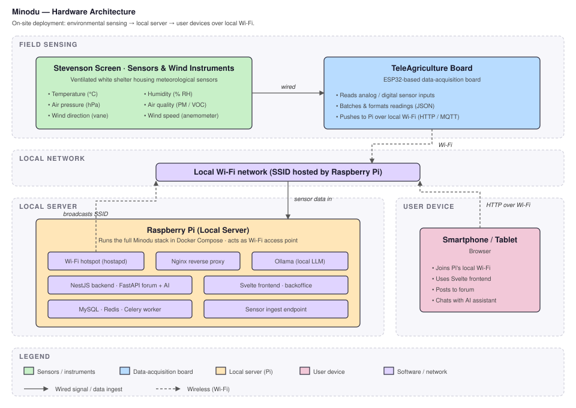
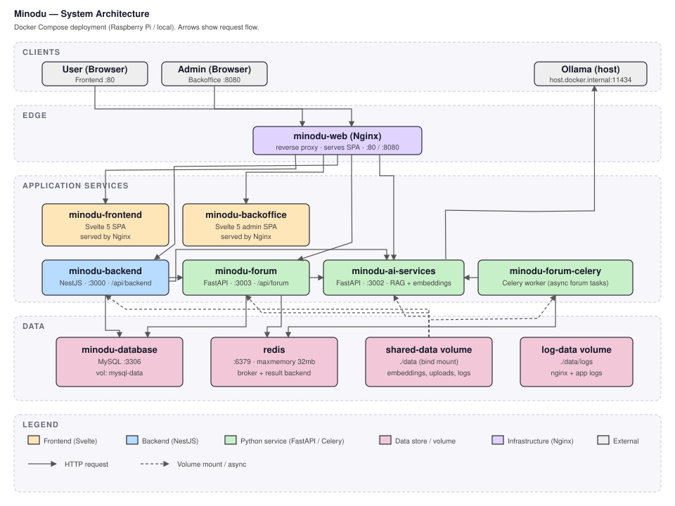

The Local Community Network (LCN) is a decentralised, offline-first system combining hardware, software, and local networking.

**Key Design Principles**

- local Wi-Fi network  
- local data storage  
- local access via browser
- local llm
- low power consumption

**Data flow**

1. Sensors collect environmental data  
2. Data is processed and stored locally on the Raspberry Pi  
3. The application provides access to data through a local network  
4. Administrators manage content via the backoffice 

## Offline-first design

---

## Components

The system consists of three hardware components:

- **Raspberry Pi (Local Server)**  
  Hosts the application and creates a local Wi-Fi network  

- **Teleagriculture Board**
  Reads and collects the sensor data from the weather sensors and sends them to the raspberry pi.

- **Stevenscreen with Sensors and Wind instruments**  
  Collect environmental data such as temperature, humidity, air pressure, air quality, wind direction and speed

## Software Architecture

The software stack runs in several seperate docker containers. They are all build from the main minodu repository, which houses a monorepo with all the components:

* **Minodu Backend** serves a REST API to access and edit agricultural data, weather data and market information
* **Minodu Forum** serves a REST API to interact with the forum
* **Minodu AI Services** runs an API to interact with the llm, speech to text and text to speech functionalities
* **Minodu Database** serves a mysql database which holds all the shared data of the components
* **Mindu Frontend** serves the web frontend to access the minodu services
* **Minodu Backoffice** serves the backoffice for the admin to edit the system data

