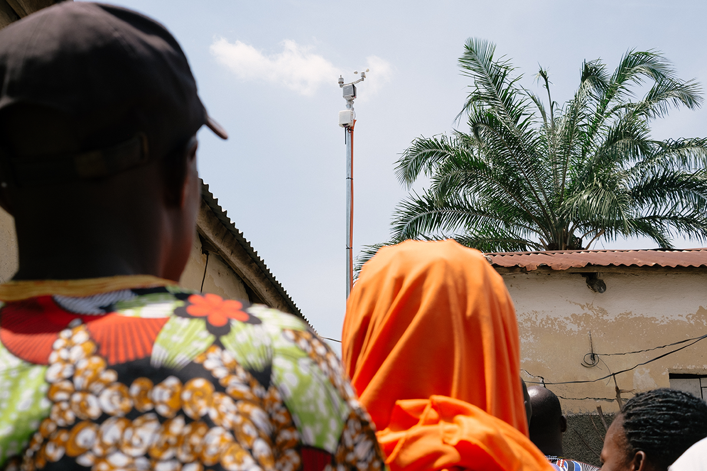

# Welcome to the Minodu Project

## Fostering local sustainable development through technology and research

{: .cover-image}

Climate change and population growth in sub-Saharan Africa make it difficult to manage land sustainably while conserving natural resources. There is often a gap between existing, scientific concepts on sustainable land management and concrete solutions on the ground.

## Getting started

Choose what you want to do:

- **Build the system** → [Setup guide](setup)  
- **Use the system** → [Manual](manual)  
- **Manage the system** → [Backoffice](manual/backoffice)  
- **Understand the system** → [Documentation](docs) 

## Explore

* [About the Minodu project](about)
* [Setup guide](setup)
    * [Material list](setup/materials)
    * [Hardware assembly](setup/hardware)
    * [Raspberry PI installation](setup/pi)
    * [Teleagriculture installation](setup/teleagriculture)
* [Manual](manual)
    * [Minodu app](manual/app)
    * [Backoffice](manual/backoffice)
* [Documentation](docs)
     * [System Architecture](docs/system-architecture)
     * [Minodu API](docs/api)
     * [Workshop materials](docs/workshop)

