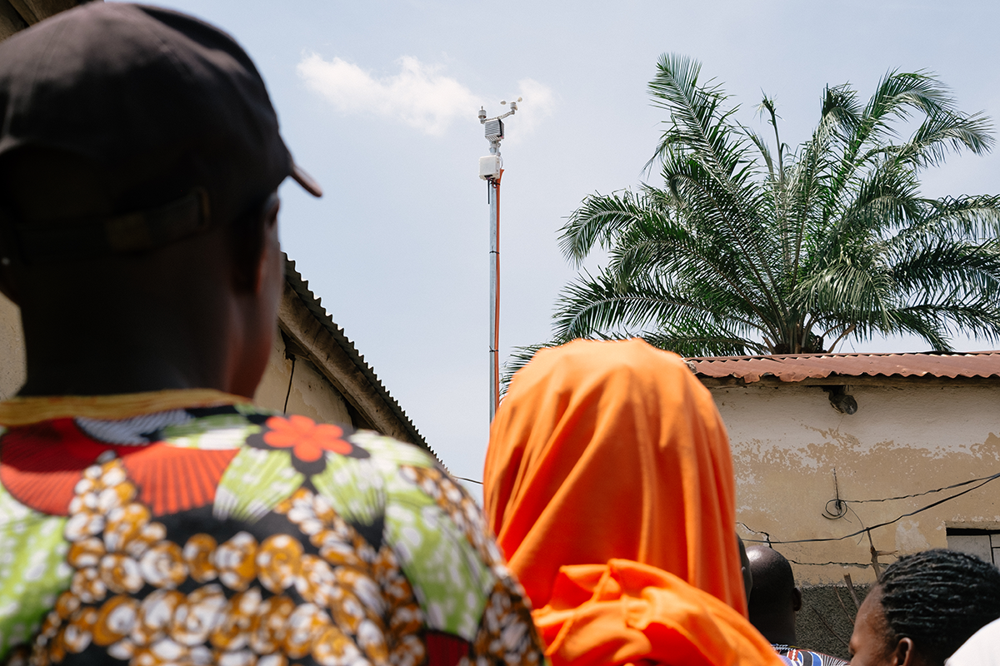

# Welcome to Minodu!

## Fostering local sustainable development through technology and research

{: .cover-image}

Climate change and population growth in sub-Saharan Africa make it difficult to manage land sustainably while conserving natural resources. There is often a gap between existing, scientific concepts on sustainable land management and concrete solutions on the ground.
Welcome to Minodu! 

Together with rural communities in the Kara region of northern Togo, students, researchers, and technical partners, the project co-designed a Local Community Network that works without continuous internet access or electricity. It provides local weather data, agricultural audio content in French and Kabiyè, a community forum, and a market interface. The system combines low-cost hardware, environmental sensing, local knowledge, and community-based maintenance. 

## Getting started

What do you want to do?

- **Build or repair the system** → [Setup guide](setup)  
- **Use the local network** → [Manual](manual)  
- **Manage the system** → [Backoffice](manual/backoffice)  
- **Understand the system** → [Documentation](docs) 

## Explore

* [About the Minodu project](about)
* [Setup guide](setup)
    * [Material list](setup/materials)
    * [Hardware assembly](setup/hardware)
    * [Raspberry PI installation](setup/pi)
    * [Teleagriculture installation](setup/teleagriculture)
* [Manual](manual)
    * [Minodu app](manual/app)
    * [Backoffice](manual/backoffice)
* [Documentation](docs)
     * [System Architecture](docs/system-architecture)
     * [Minodu API](docs/api)
     * [Workshop materials](docs/workshop)

