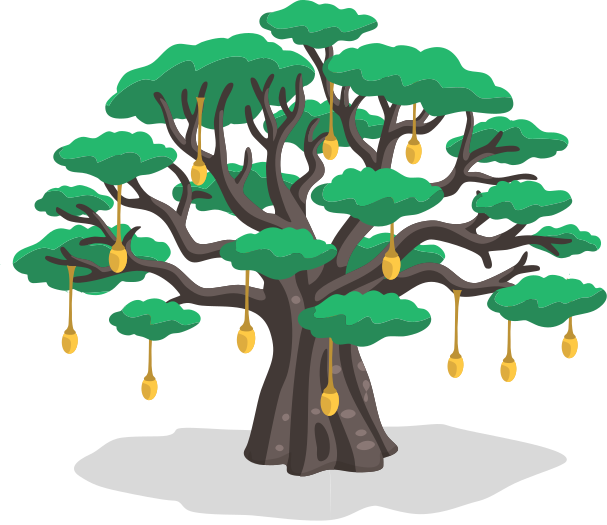

## Toolkit for Setting Up a Local Network and a DIY Weather Station
{:.no_toc}

This manual is aimed at the agricultural producers of the communities we deployed the Local Community Network (LCN) in. The original french version was printed and handed out to the communities as a guide to accompany the usage of the LCN. It can be viewed and downloaded here: [french version of the manual (print)](../assets/pdf/minodu_manuel_v2.pdf).

## Content
{:.no_toc}
* TOC
{:toc}

## Introduction
___
 
This guide is for you, the agricultural producers of Tchitchao, Lama-Saoudé and Soumdina-Haut.  
It accompanies the usage of the **Local Community Network (LCN) without Internet connection**.  
A network **made by you**, **for you**, based on your knowledge and experience.

### The Minodu project
Minodu is a participative research project. It bridges local knowledge with scientific knowledge to better address the effects of climate change. The project follows a **co-design**-approach: We design, test and build together.

### Objectives
Launched in 2023 in the Kara region, Minodu aims to:

- facilitate access to useful knowledge without reliance on the Internet
- promote local knowledge and on-the-ground experience, particularly of the communities of Tchitchao, Lama-Saoudé and Soumdina-Haut
- co-create and develop practical solutions with the communities
- strengthen self-reliance and mutual aid among villages

Students from the university of Kara are working with you to develop **simple and practical** solutions that are **adapted to your specific needs**.

**DIY** stands for **«Do It Yourself»**. It means making things using simple materials, without the need to hire expensive professionals. DIY helps to build a **robust**, **local community network** that is **inexpensive** and that you can **maintain on your own**.

### Partners
This innovation is the result of a collaboration between the following parties:

- Local communities: Tchitchao, Lama-Saoudé, Soumdina-Haut
- University of Kara: Magnim Essolakina BOKOBANA, Damghane OUDANOU, Mikémina PILO
- DFKI (German Center for Artificial Intelligence): Carina Lange, Friederike Fröbel, Antonia Katthaen, Jannes Ulbrich, Philipp Gschwendtner
- Contributers: Séti AFANOU, Nihade ASSOUMANOU, Abiré BÉRÉ, Ousia FOLI-BEBE, Lutz Reiter, Eric Tiedt, Victoire TSAMEDI

## Local Network / Réseau Local
___
 
Your local network (réseau local) runs on a single mini-computer called a Raspberry Pi. When you turn it on, it creates a private Wi-Fi network (without internet access!) that is accessible to everyone in your community via an Android phone. Through this private Wi-Fi network, you can access agricultural content in Kabiyè and French.

### The LCN application
Welcome to your digital platform! It is designed to help you:
- get farming advice
connect with others and share your knowledge and challenges on the field
- access local weather information
- sell your products at the market

**Additional information:**
*The application was implemented with the expertise of the technical team:
Séti AFANOU (software), Ousia FOLI-BÉBÉ (hardware/software interface), Friederike Fröbel (coordination and management), Lutz Reiter (software), Eric Tiedt (illustrations, animations), Victoire TSAMEDI (database), Jannes Ulbrich (UI/UX design, wireframing)*

### Access the app
1) Start by connecting to the "Minodu" Wi-Fi network.

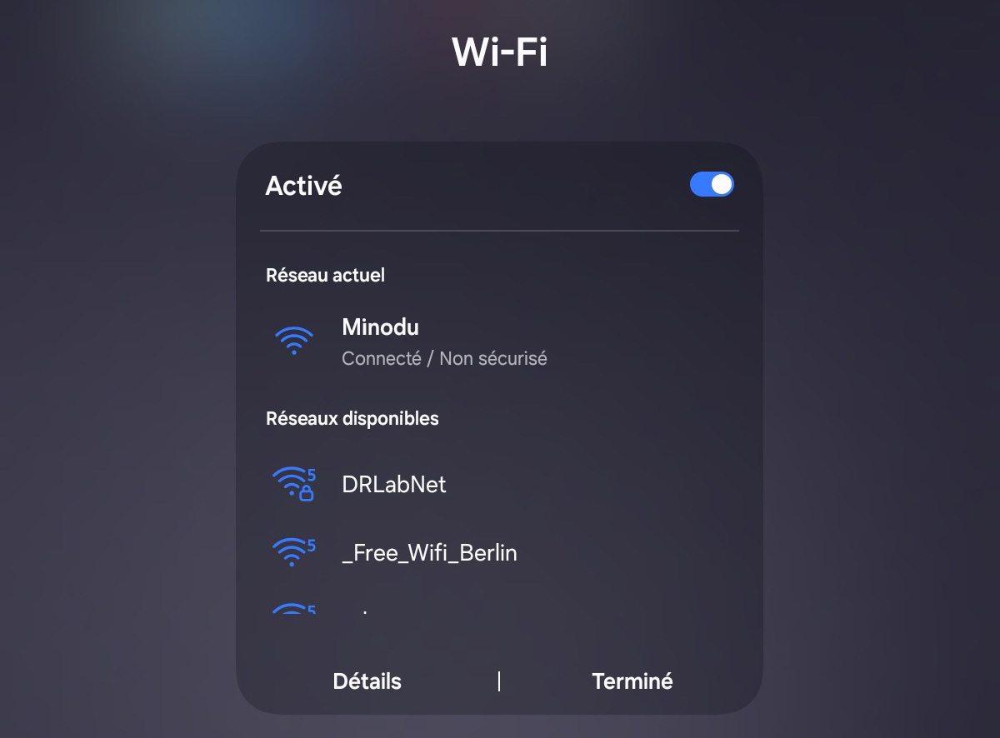

2) Open your browser and enter the address **minodupi.local**

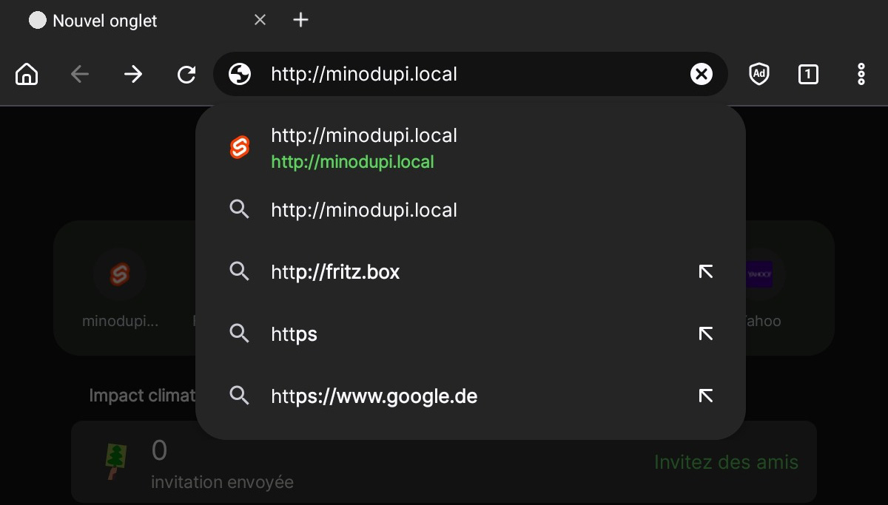

http://minodupi.local

### Home Page
This is where you land when you launch the local network. This is the home page.

The app is divided into four sections: agriculture, market, forum, and weather.

Simply click on the section of your choice on the home screen or in the menu bar at the bottom of the interface to navigate to the selected section.

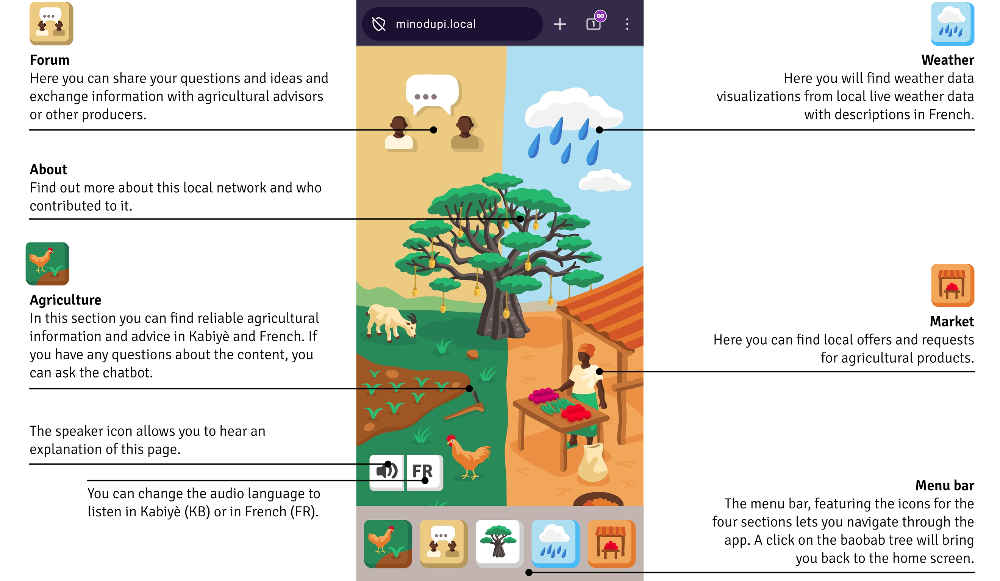

### Agriculture Page
This section contains reliable agricultural information and advice, as well as a chatbot—a conversational agent—that you can use to ask questions about the content.

This includes:
- best farming practices
- advice on crops, soil conservation, and livestock farming
- innovations and sustainable techniques

Improve your yields and make better farming decisions.

**How to use the agriculture page?**

The audios are oraganized into four categories: plants, soil, livestock, and other. You can select or deselect the different categories by clicking on their icons at the top.

To access the audio files:
Click the play button (small triangle) to play the audio. 
To pause, click the two lines that appear once you start playing the audio.

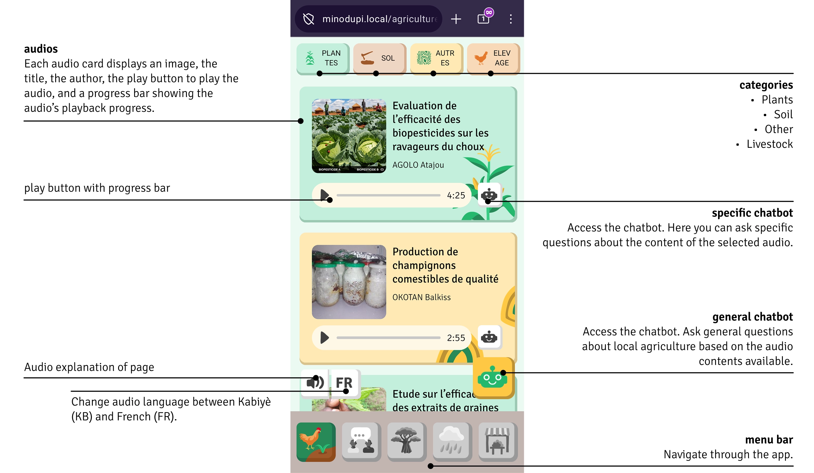

### Chatbot
The chatbot can answer your questions about agriculture around the clock. It can only understand and speak french.

**How to use the chatbot?**

When you open the chatbot, it will greet you. To respond to the chatbot and ask your question, you have two options:
1. Record an audio message by clicking the white microphone icon on a green background and speaking. Your message will be automatically transcribed into text. Note: Make sure the audio recording is no longer than 30 seconds.
2. Write a message using the white field at the bottom and type your message there.

Then, click the green paper airplane icon to send your question.

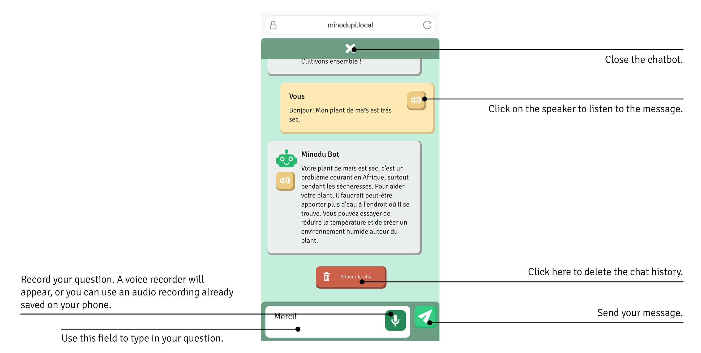

### Forum
Connect with the active community:
- Ask questions via text or voice message
- Share photos of issues in your fields
- Share your experiences and chat with other farmers from your community
- Discuss the challenges and opportunities facing the agricultural sector

Because agriculture thrives best when we work together. Messages can be transcribed and listened to only in French.

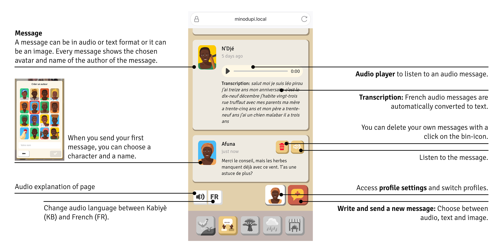

### Weather
This screen visualizes local live weather data. The current weather is displayed through animations and shown in figures. The audio weather report gives you information about the current weather.

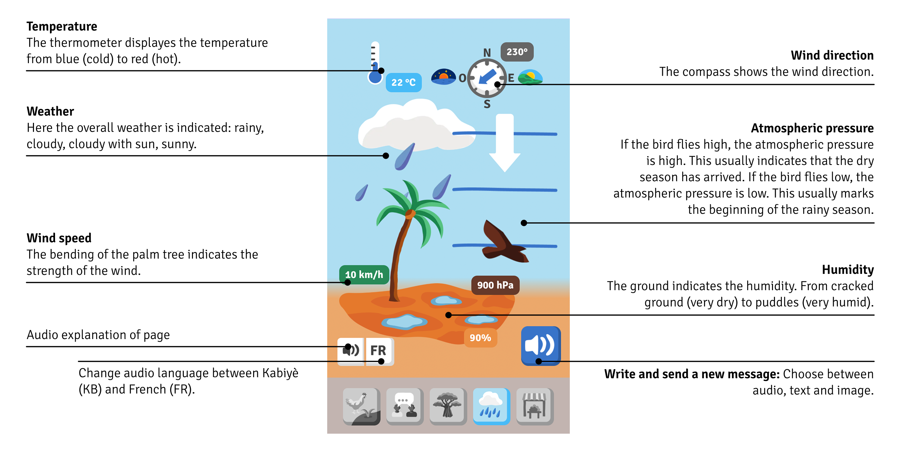

### Market
Welcome to your local digital marketplace! Here you can view various listings. The contact person in your community receives requests from wholesalers and posts them here. This way, you can see how many units of each product are in demand and at what price.

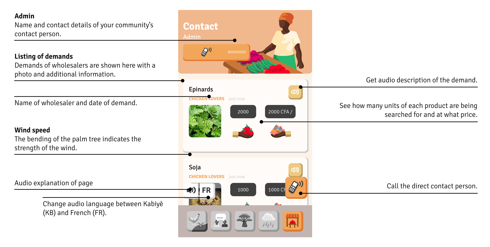

## Materials
___
 
Your toolkit contains all the equipment you need to set up your local network. Here are the four main components:

The Raspberry Pi mini-computer which is at the core of the local network, the weather station board which captures temperature, humidity, rain, wind and air quality, and the 3D printed protection box which keeps the boards dry and cool (protected from dust, heat and rain).

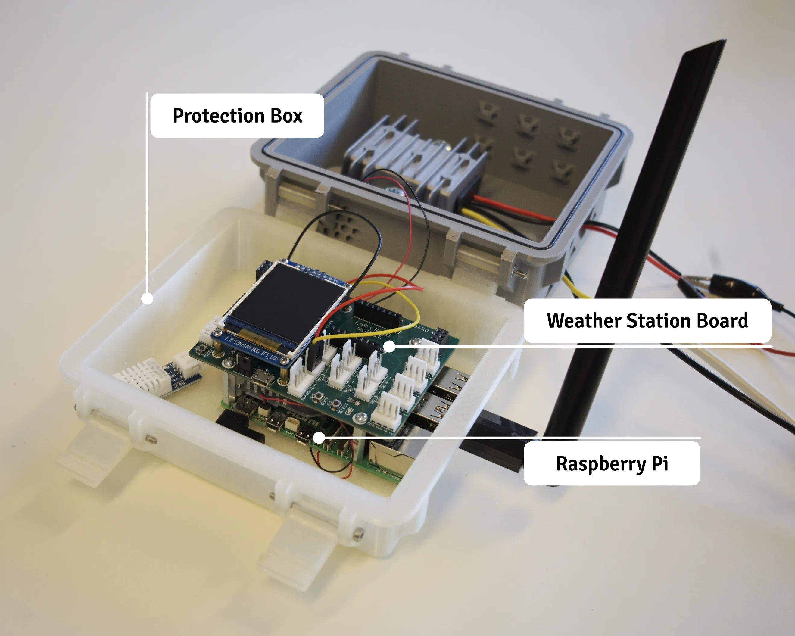

Your Local Community Network is powered by a solar panel connected to a battery for complete energy independence.

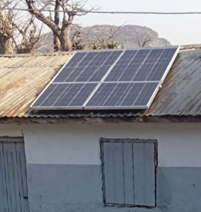

### Core of the LCN: Raspberry Pi 5

### Weather station: TeleAgriCulture Board & sensors

### Admin panel & content management system

## Support
___
 