## Minodu – Administrator Backoffice Documentation
{:.no_toc}

|---|---|
| **Version** | 1.0 |
| **Date** | May 2026 |
| **Language** | English |
| **Audience** | MINODU system administrators |

## Content
{:.no_toc}
* TOC
{:toc}

---

## Authentification – Login
The login page is the single entry point to the MINODU backoffice. Only users with the **ADMIN** role and an **ACTIVATED** account can access the platform.

### 1.1 Features
{:.no_toc}
- Authentication using phone/username and password
- Show/hide password using the eye icon
- Session management via tokens (JWT)
- Custom error messages depending on the failure type
- Protection against unauthorized access

### 1.2 Access Instructions
To log in to the MINODU backoffice dashboard:

1. Open your web browser and navigate to: **http://minodu.local:8080**
2. You will be presented with the MINODU login screen.
3. Enter your credentials in the designated fields:

| Field | Value |
|-------|-------|
| **Username** | `admin` |
| **Password** | `secret` |

4. Click the **"Login"** or **"Connexion"** button to authenticate.

### 1.2 Screenshots
{:.no_toc}

| Description | Screenshot |
|---|---|
| Login page – full form | 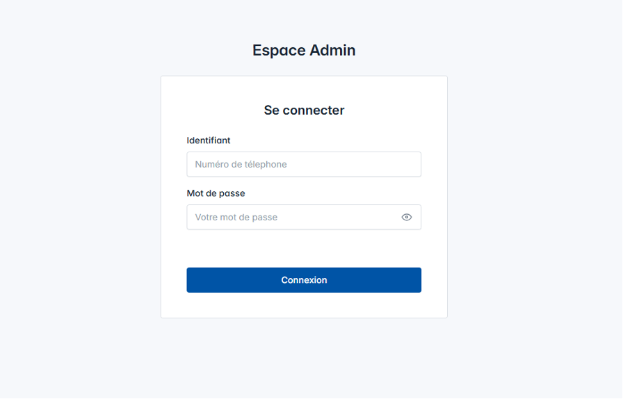 |

---

## Home – Dashboard

The first page displayed after login. It provides a statistical overview of the MINODU community with key indicators updated dynamically in real time.

### 2.1 Features
{:.no_toc}
- Display of the community name
- Publications counter
- Products counter
- Registered members counter
- Last login timestamp
- Logout button with confirmation modal
- Real-time data updates

### 2.2 Sections
{:.no_toc}
#### Section 1 – Header with logout
{:.no_toc}

|---|---|
| **Title** | Welcome message with the admin name |
| **Action** | “Logout” button → opens confirmation modal |

#### Section 2 – Statistics cards
{:.no_toc}

| Card | Description |
|---|---|
| **Card 1** | Community name |
| **Card 2** | Total number of publications |
| **Card 3** | Total number of products |
| **Card 4** | Total number of registered members |

#### Section 3 – Marketplace presentation
{:.no_toc}
Descriptive section of the platform with a general description and information about the MINODU marketplace.

#### Section 4 – Logout confirmation modal
{:.no_toc}
Confirmation popup before logout. Buttons: **Confirm / Cancel**.

#### Section 5 – Recent publications list
{:.no_toc}

Displays recent publications from the community.

### 2.3 Screenshots
{:.no_toc}

| Description | Screenshot |
| ---- | ---- |
| Complete dashboard | 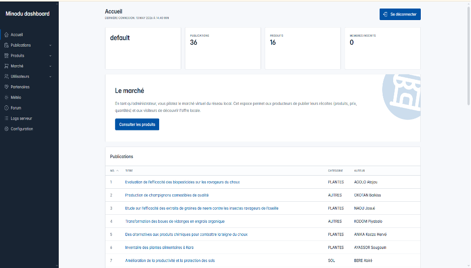 |
| Logout confirmation modal | 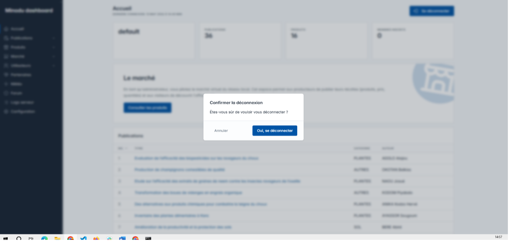 |

---

## Publications
Module for managing the MINODU community’s editorial content. This module is divided into four subsections: publication list, categories, tags, and the detailed view of a publication.

### 3.1 Publication List

**Full CRUD – publications with media and attachments**

Displays and manages all community publications. The administrator has access to all CRUD operations as well as advanced search and filtering tools.

#### Features
{:.no_toc}

- **Read:** paginated publications table
- **Create:** add via dedicated modal
- **Update:** edit all properties
- **Delete:** with confirmation modal
- **Search:** filter by title, author, category, and tags
- **Uploads:** images, French/Kabyè audio, PDF, resources

#### Sections
{:.no_toc}

**Section 1 – Title bar and actions**

|---|---|
| **Title** | “Publications” |
| **Action** | “Add” button |

**Section 2 – Filters and search**

|---|---|
| **Search** | Text field – filter by title, author, category, and tags |

**Section 3 – Publications table**

|---|---|
| **Column 1** | Publication title |
| **Column 2** | Category |
| **Column 3** | Author |
| **Column 4** | Actions: Edit \| Delete |
| **Navigation** | Pagination between pages |

**Section 4 – Add/Edit modal**

|---|---|
| **Field 1** | Author (required) |
| **Field 2** | Title (required) |
| **Field 3** | Description (long text) |
| **Field 4** | Category (selector) |
| **Upload 1** | Main image (PNG/JPEG) |
| **Field 5** | Tags (multiple selection) |
| **Upload 2** | French audio |
| **Upload 3** | Kabyè audio |
| **Upload 4** | PDF file |
| **Actions** | Save \| Cancel |

**Section 5 – Delete modal**

Confirmation before permanent deletion. Buttons: **Confirm / Cancel**.

#### Feedback messages
{:.no_toc}
- “Publication added successfully!”
- “Publication updated successfully!”
- “Publication deleted successfully!”

#### Screenshots
{:.no_toc}

| Description | Screenshot |
| ---- | ---- |
| Publications – full table with pagination | 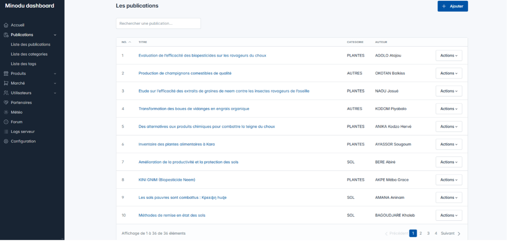 |
| Publications – Add/Edit modal | 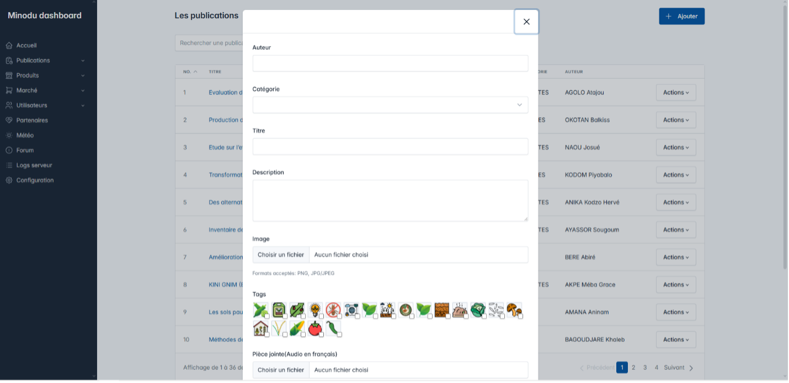 |
| Publications – delete confirmation modal | 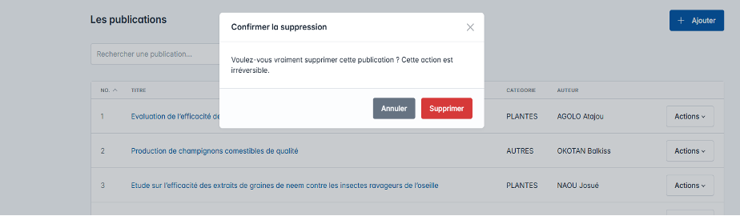 |

### 3.2 Publication Categories

**CRUD – bilingual French/Kabyè support**  
Management of categories that organize publications. Each category has a name in two languages (French and Kabyè) and can be illustrated with an image.

#### Features
{:.no_toc}

- **Read:** list of all categories
- **Create:** new category with image
- **Update:** edit name (FR/Kabyè) and image
- **Delete:** with confirmation
- **Bilingual support:** French and Kabyè fields required

#### Sections
{:.no_toc}

**Section 1 – Header**

|---|---|
| **Title** | “Categories” |
| **Action** | “Add” button |

**Section 2 – Categories table**

|---|---|
| **Column 1** | Name in French |
| **Column 2** | Name in Kabyè |
| **Column 3** | Actions: Edit \| Delete |

**Section 3 – Add/Edit modal**

| **Field 1** | Name in French (required) |
| **Field 2** | Name in Kabyè (required) |
| **Upload** | PNG/JPEG image + preview |
| **Actions** | Save \| Cancel |

#### Feedback messages
{:.no_toc}
- “Category added successfully!”
- “Category updated successfully!”
- “Category deleted successfully!”

#### Screenshots
{:.no_toc}

| Description | Screenshot |
| ---- | ---- |
| Publication Categories – table | 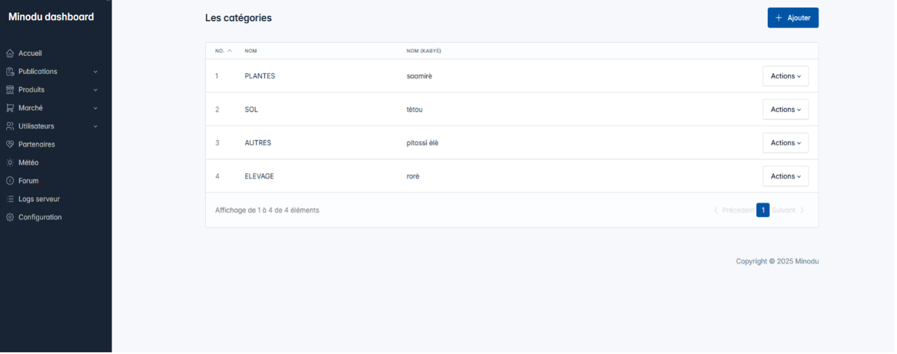 |
| Publication Categories – Add/Edit | 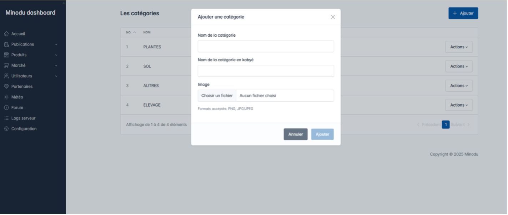 |

### 3.3 Publication Tags

**CRUD – labels with avatars**  
Tags are labels associated with publications to improve organization and search. Each tag can have an illustrative image/avatar.

#### Features
{:.no_toc}

- **Read:** table with avatars
- **Create:** add with image
- **Update:** edit name and image
- **Delete:** with confirmation
- **Avatars:** each tag can have an illustration

#### Sections
{:.no_toc}

**Section 1 – Header and actions**

| --- | --- |
| **Title** | “Tags” |
| **Action** | “Add” button |

**Section 2 – Tags table**

|---|---|
| **Column 1** | Avatar (tag image) |
| **Column 2** | Tag name |
| **Column 3** | Actions: Edit \| Delete |

**Section 3 – Add/Edit modal**

|---|---|
| **Field 1** | Tag name (required) |
| **Upload** | PNG/JPEG image/avatar + preview |
| **Actions** | Save \| Cancel |

#### Feedback messages
{:.no_toc}
- “Tag added successfully!”
- “Tag updated successfully!”
- “Tag deleted successfully!”

#### Screenshots
{:.no_toc}

| Description | Screenshot |
| --- | --- |
| Publication tags – table | 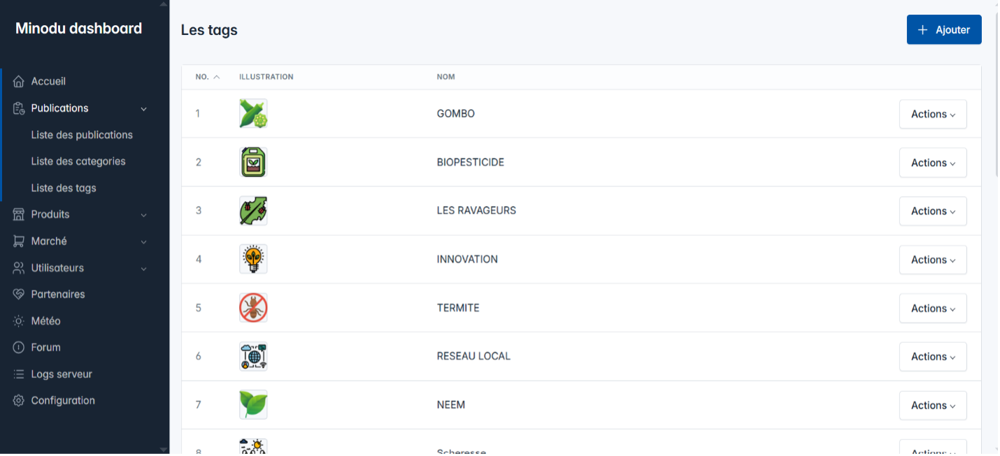 |
| Publication Tags – Add/Edit modal | 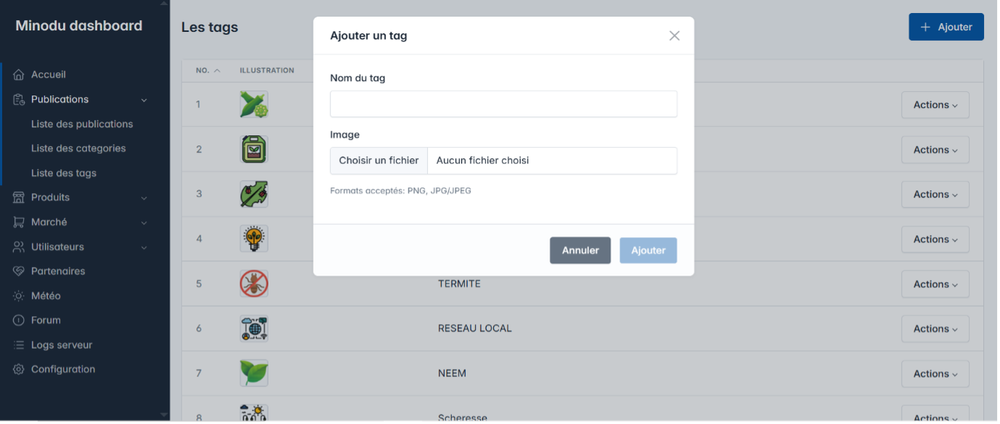 |

### 3.4 Publication Details

**Detailed view – full consultation and editing**  
Page for in-depth consultation and editing of a single publication, accessible from the list through the “View” button. All properties and media are displayed and editable.

#### Features
{:.no_toc}
- **Consultation:** display all details
- **Update:** edit title, description, category, tags, images, and attachments
- **Navigation:** breadcrumb (Publications > Details)
- **Author:** complete author information
- **Upload:** change images and attachments

#### Sections
{:.no_toc}

**Section 1 – Header with navigation**

|---|---|
| **Breadcrumb** | Publications → Details |
| **Info** | Author name and information |

**Section 2 – General information**

|---|---|
| **Title** | Full publication title |
| **Description** | Full text |
| **Category** | Assigned category |

**Section 3 – Media and attachments**

|---|---|
| **Image** | Main publication image |
| **Tags** | List of associated tags |
| **Audio** | Audio files (FR and Kabyè) |
| **PDF** | Attached PDF documents |

**Section 4 – Action buttons**

|---|---|
| **Action 1** | Edit publication |
| **Action 2** | Return to list |

#### Screenshots
{:.no_toc}

| Description | Screenshot |
| --- | --- |
| Publication Details – full view (information + media) | 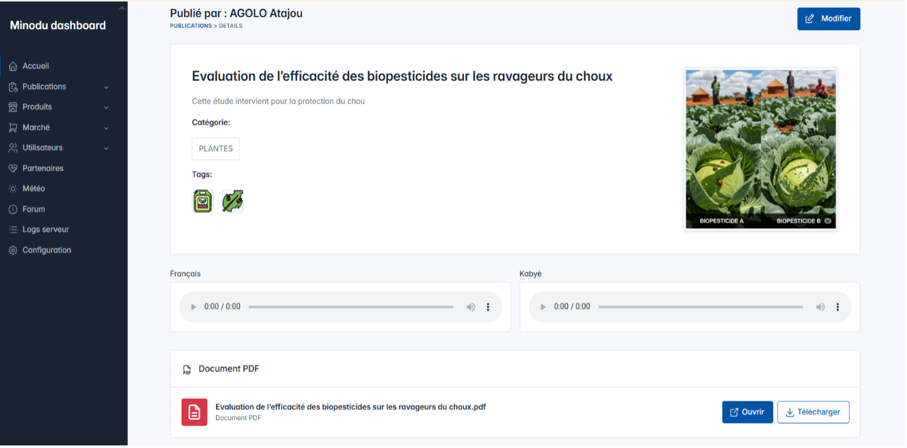 |

---

## Products
Module for managing the MINODU platform’s product catalog. It includes management of products themselves and their categories.

### 4.1 Product List

**Full CRUD – product catalog with images**  
Displays and manages the complete product catalog. The administrator can add, edit, and delete products, manage their properties (name, description, category, price, sales unit), and manage their images.

#### Features
{:.no_toc}

- **Read:** paginated table with all products
- **Create:** add via modal with image
- **Update:** edit all properties
- **Delete:** with confirmation
- **Images:** upload and manage PNG/JPEG files

#### Sections
{:.no_toc}

**Section1 – Header and actions**

|---|---|
| **Title** | “Products” |
| **Action** | “Add” button |

**Section 2 – Products table**

|---|---|
| **Column 1** | Product image |
| **Column 2** | Product name |
| **Column 3** | Category |
| **Column 4** | Price |
| **Column 5** | Actions: Edit \| Delete |

**Section 3 – Add/Edit modal**

|---|---|
| **Field 1** | Product name (required) |
| **Field 2** | Description |
| **Field 3** | Category (selector) |
| **Field 4** | Price (decimal value) |
| **Field 5** | Sales unit |
| **Upload** | PNG/JPEG image |
| **Actions** | Save \| Cancel |

#### Feedback messages
{:.no_toc}
- “Product added successfully!”
- “Product updated successfully!”
- “Product deleted successfully!”

#### Screenshots
{:.no_toc}

| Description | Screenshot |
| --- | --- |
| Products – full table | 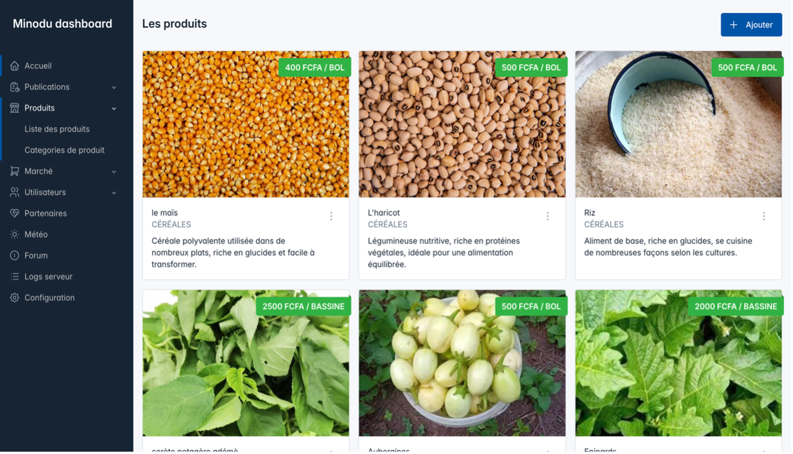 |
| Products – Add/Edit modal | 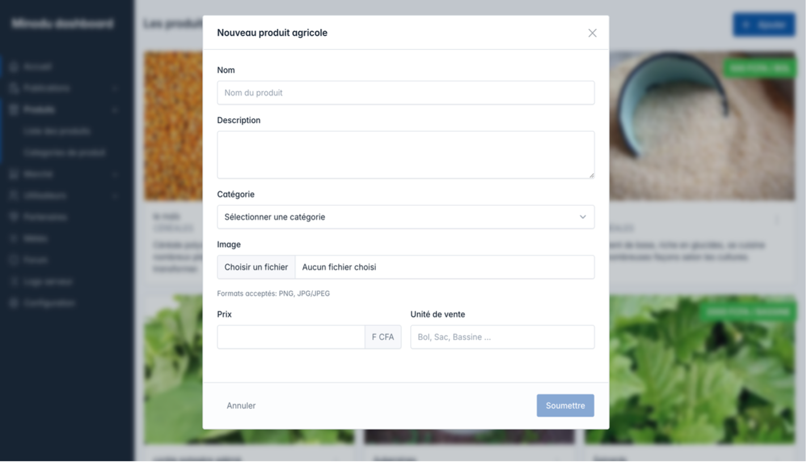 |

### 4.2 Product Categories

**CRUD – categories with illustrative images**  
Management of categories that organize products (e.g., vegetables, fruits, grains, etc.). Each category can be illustrated with an image.

#### Features
{:.no_toc}
- **Read:** list of all categories
- **Create:** add with image
- **Update:** edit name and image
- **Delete:** with confirmation
- **Images:** PNG/JPEG support

#### Sections
{:.no_toc}

**Section 1 – Header**

|---|---|
| **Title** | “Categories” |
| **Action** | “Add a category” button |

**Section 2 – Categories table**

|---|---|
| **Column 1** | Illustration image |
| **Column 2** | Category name |
| **Column 3** | Actions: Edit \| Delete |

**Section 3 – Add/Edit modal**

|---|---|
| **Field** | Category name (required) |
| **Upload** | PNG/JPEG image + preview |
| **Actions** | Save \| Cancel |

#### Feedback messages
{:.no_toc}
- “Product category added!”
- “Product category updated!”
- “Product category deleted!”

#### Screenshots
{:.no_toc}

| Description | Screenshot |
| --- | --- |
| Product Categories – table | 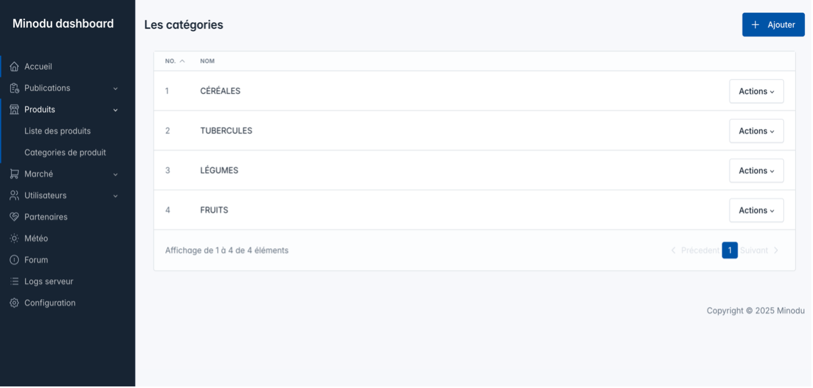 |
| Product Categories – Add/Edit modal | 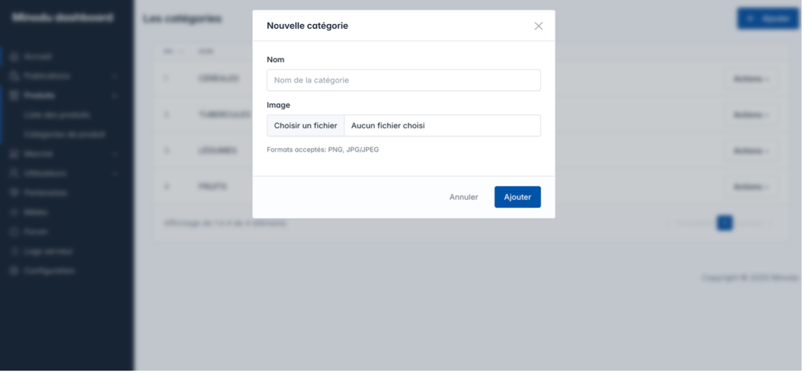 |

---

## Marketplace
Module for managing the MINODU marketplace. It brings together product offers published by producers/companies and product requests submitted by customers.

### 5.1 Product Offers

**Supply marketplace – published availability**  
Management of product offers: the availability that producers and companies highlight on the platform.

#### Features
{:.no_toc}
- **Read:** table of available offers
- **Create:** add a new offer
- **Update:** edit offer details
- **Delete:** remove an offer

#### Sections
{:.no_toc}

**Section 1 – Header**

|---|---|
| **Title** | “Product availability” |
| **Action** | “Add” button |

**Section 2 – Offers table**

|---|---|
| **Column 1** | Product |
| **Column 2** | Available quantity |
| **Column 3** | Producer price |
| **Navigation** | Pagination |

**Section 3 – Add/Edit modal**

|---|---|
| **Field 1** | Product selection |
| **Field 2** | Available quantity |
| **Field 3** | Producer |
| **Actions** | Save \| Cancel |

#### Screenshots
{:.no_toc}

| Description | Screenshot |
| --- | --- |
| Product Offers – full table | 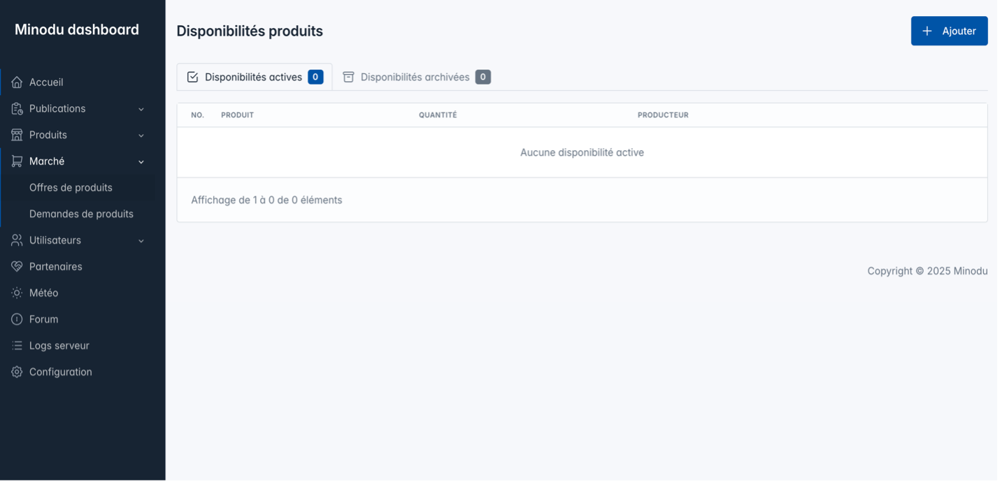 |
| Product Offers – Add/Edit modal | 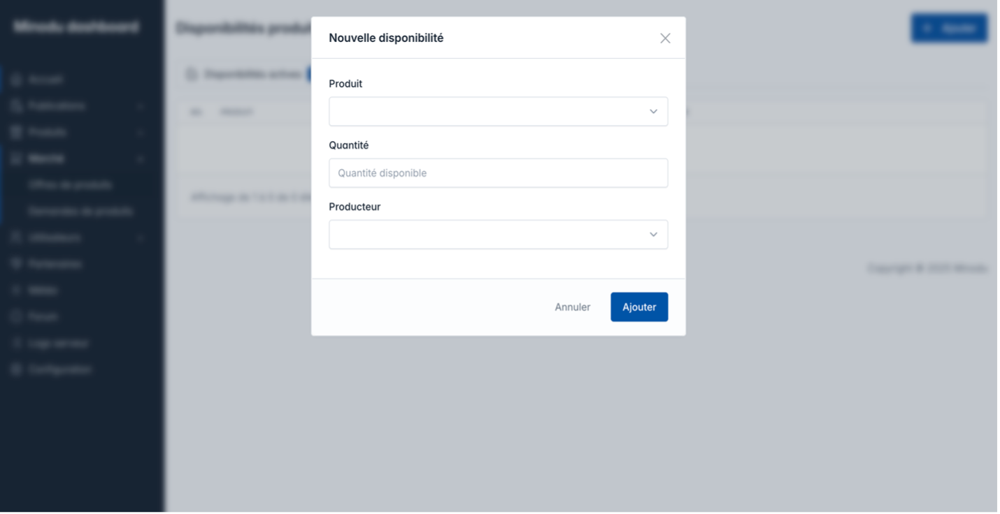 |

### 5.2 Product Requests

**Demand marketplace – customer needs**  
Management of product requests: needs expressed by customers looking for products on the MINODU platform.

#### Features
{:.no_toc}
- **Read:** table of received requests
- **Status:** track request status
- **Details:** see who requests what and when
- **Tracking:** archive or process requests

#### Sections
{:.no_toc}

**Section 1 – Header**

|---|---|
| **Title** | “Product Requests” |

**Section 2 – Requests table**

|---|---|
| **Column 1** | Requested product |
| **Column 2** | Requested quantity |
| **Column 3** | Partner |
| **Column 4** | Deadline date |
| **Column 5** | Actions: Edit \| Archive \| Delete |
| **Navigation** | Pagination |

#### Screenshots
{:.no_toc}

| Description | Screenshot |
| --- | --- |
| Product Requests – full table | 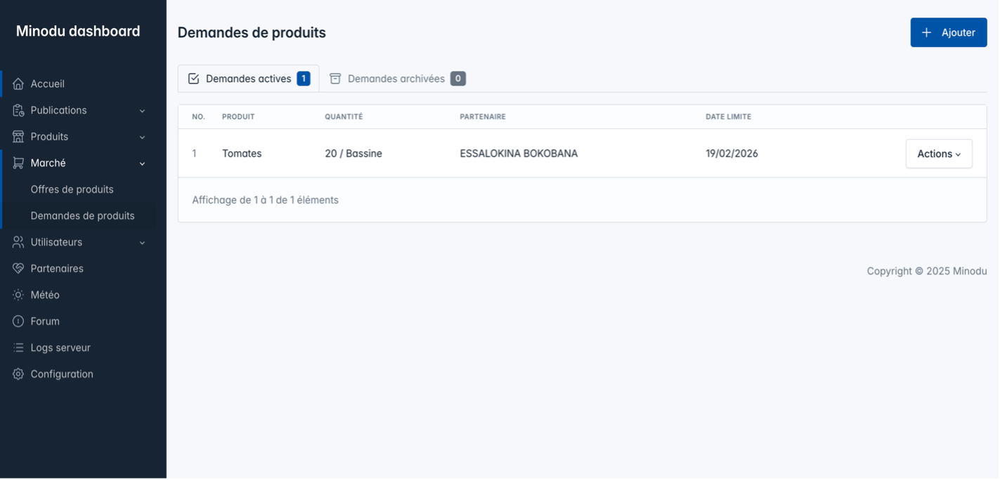 |
| Product Requests – Add/Edit modal | 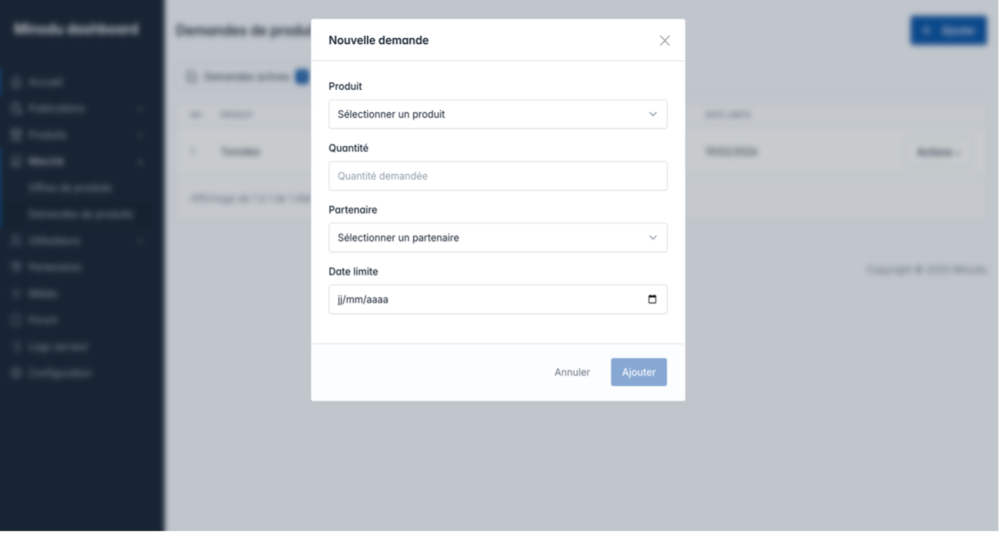 |

---

## Users
Management of all users registered on the MINODU platform. Allows administrators to consult profiles and manage roles, statuses, and permissions.

#### Features
{:.no_toc}
- **Read:** paginated list
- **Actions:** edit

#### Sections
{:.no_toc}

**Section 1 – Header**

|---|---|
| **Title** | “Users” |

**Section 2 – Users table**

|---|---|
| **Column 1** | Name |
| **Column 2** | Phone |
| **Column 3** | Role |
| **Column 4** | Contact person |
| **Column 5** | Actions: Edit |
| **Navigation** | Pagination |

#### Screenshots
{:.no_toc}

| Description | Screenshot |
| --- | --- |
| Users – table | 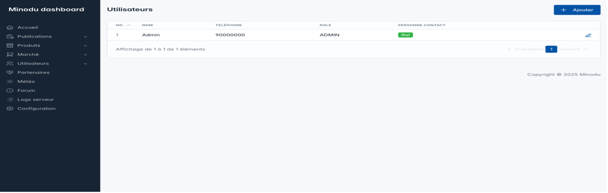 |
| Users – Add/Edit modal | 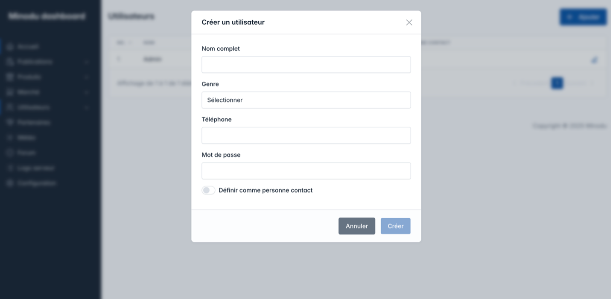 |

---

## Partners
Management of MINODU platform partners: companies, producers, and partner organizations. This section helps maintain business relationships and display partners to users.

### 7.1 Features
{:.no_toc}
- **Read:** list of all partners
- **Create:** add a new partner
- **Update:** edit information
- **Delete:** remove a partner
- **Contacts:** management of complete contact information
- **Categorization:** partner classification

### 7.2 Sections
{:.no_toc}
#### Section 1 – Header and actions
{:.no_toc}

|---|---|
| **Title** | “Partners” |
| **Action** | “Add a partner” button |

#### Section 2 – Partners table
{:.no_toc}

| **Column 1** | Name |
| **Column 2** | Address |
| **Column 3** | Phone |
| **Column 5** | Actions: Edit \| Delete |

#### Section 3 – Add/Edit modal
{:.no_toc}

|---|---|
| **Field 1** | Name |
| **Field 2** | Address |
| **Field 3** | Phone |
| **Actions** | Save \| Cancel |

### Screenshots
{:.no_toc}

| Description | Screenshot |
| --- | --- |
| Partners – full table | 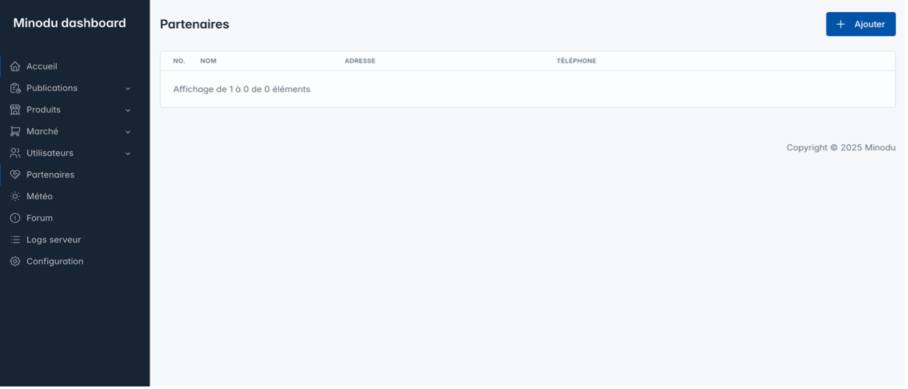 |
| Partners – Add/Edit moral | 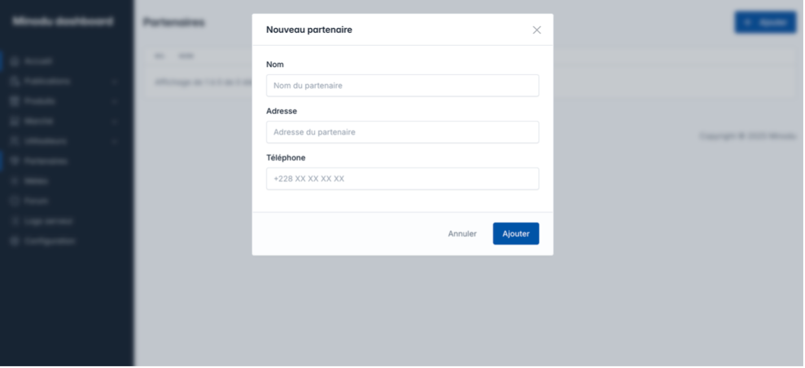 |

---

## Weather
Module for displaying weather data for the region covered by MINODU. Data is retrieved from an external service or a local weather station configured in the settings.

### 8.1 Features
{:.no_toc}
- Current weather conditions
- Short-term forecasts (following days)
- Data: temperature, humidity, wind speed, UV
- Historical weather data
- Weather station configuration via the Configuration page

### 8.2 Weather data backup
{:.no_toc}
The MINODU system provides a manual download process for weather data in XLSX format to ensure preservation and traceability of historical climate data.

| **Access** | “Download” button |
| **Format** | XLSX file with standardized structure |
| **Content** | Historical weather data |

### 8.3 Sections
{:.no_toc}

#### Section 1 – Header
{:.no_toc}

|---|---|
| **Title** | “Weather” |
| **Location** | Displayed region/locality |

#### Section 2 – Current conditions
{:.no_toc}

|---|---|
| **Data 1** | Current temperature (°C) |
| **Data 2** | Conditions (Sunny / Cloudy / Rain, etc.) |
| **Data 3** | Illustrative weather icon |

**Section 3 – Weather details**

| **Data 1** | Humidity (%) |
| **Data 2** | Wind speed (km/h) |
| **Data 3** | Atmospheric pressure (hPa) |
| **Data 4** | UV index |

**Section 4 – Forecasts**

| **Content 1** | Forecasts for the coming days |
| **Content 2** | Temperature charts |

### 8.4 Screenshots
{:.no_toc}

| Description | Screenshot |
| --- | --- |
| Weather – full dashboard | 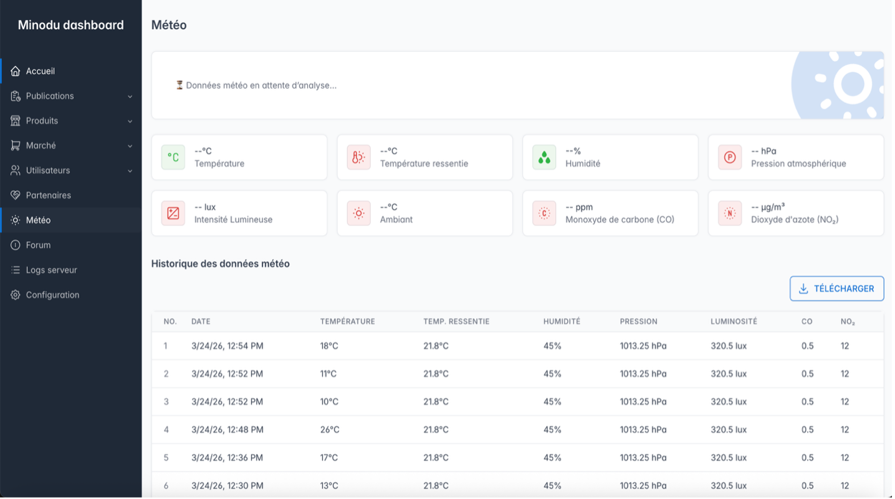 |

---

## Forum
Community discussion space for MINODU members. It enables exchanges between members, information sharing, and creation of discussion topics. The administrator has moderation rights.

### 9.1 Features
{:.no_toc}
- **Read:** display active discussions
- **Moderation:** delete

### 9.2 Sections
{:.no_toc}

#### Section 1 – Header
{:.no_toc}

|---|---|
| **Title** | “Forum” |

#### Section 2 – Discussion List
{:.no_toc}

|---|---|
| **Column 1** | Discussion title |
| **Column 2** | Author |
| **Column 3** | Actions: Detail \| Delete |

### 9.3 Screenshots
{:.no_toc}

| --- | --- |
| Forum – discussion list | 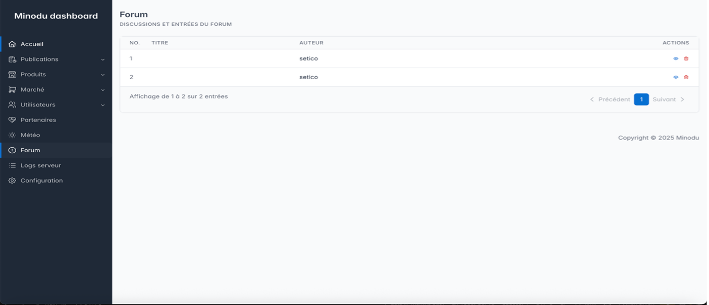 |
| Forum – detailed discussion | 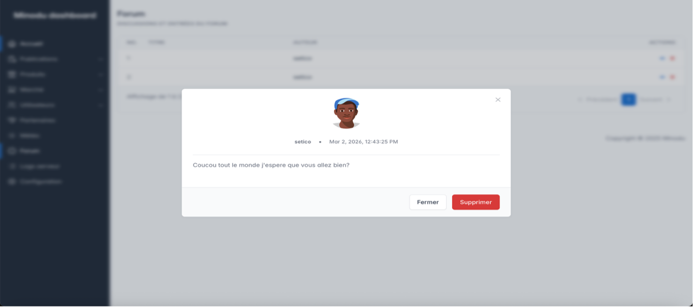 |
| Forum – delete confirmation modal | 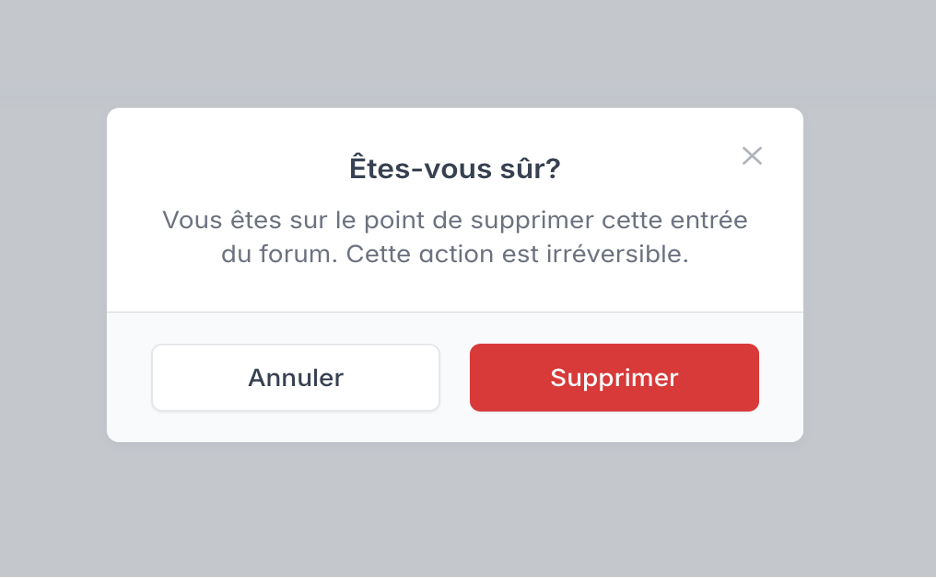 |

---

## Server Logs
Display and management of system event logs. This makes it possible to track all actions, errors, connections, and overall backoffice activity. Navigation is organized around two axes: log source and event type.

### 10.1 Features
{:.no_toc}
- **Filter by source:** Backend \| Frontend \| RAG (dropdown)
- **Filter by type:** All \| Errors only \| Access only (tabs)
- **Deletion:** log cleanup (with confirmation)

### 10.2 Log navigation
{:.no_toc}

#### Axis 1 – Source selector (Dropdown)
{:.no_toc}
Dropdown at the top of the page for selecting the source.

| Source | Description |
|---|---|
| **Backend** | Server logs – transactions, HTTP requests, database, server errors |
| **Frontend** | Client logs – clicks, loads, JavaScript errors, console errors |
| **RAG** | AI engine logs – requests, vector transformations, recommendations |

⚠️ The “Frontend” source is selected by default.

#### Axis 2 – Filtering tabs
{:.no_toc}
Three tabs below the dropdown for filtering by event type.

| Tab | Description |
|---|---|
| **All logs** | All events: errors + warnings + information + access |
| **Errors only** | HTTP 400–599, exceptions, critical warnings – red/orange color |
| **Access only** | Authentications, login attempts, role changes – green/orange |

⚠️ The “All logs” tab is active by default.

### 10.3 Sections
{:.no_toc}

#### Section 1 – Header
{:.no_toc}

|---|---|
| **Title** | “Server logs” |
| **Subtitle** | “Display and management of server logs” |

#### Section 2 – Source selector (Dropdown)
{:.no_toc}

Dropdown selection: **Frontend** (default) \| **Backend** \| **RAG**.

#### Section 3 – Filtering tabs
{:.no_toc}

Three tabs: **All logs** (default) \| **Errors only** \| **Access only**.

#### ### Section 4 – Log file management
{:.no_toc}

Optional deletion: “Delete logs” button with mandatory confirmation before execution.

⚠️ Delete logs every 3 months.

### 10.4 Usage scenarios
{:.no_toc}

| Scenario | Steps |
|---|---|
| **Scenario 1 – View all backend logs** | 1. Menu → Server logs 2. Dropdown (Source) → Select “Backend” 3. Tab (Filtering) → “All logs” 4. All server events are displayed |
| **Scenario 2 – Find a frontend error** | 1. Menu → Server logs 2. Dropdown (Source) → Select “Frontend” 3. Tab (Filtering) → “Errors only” 4. Only matching frontend errors are displayed |
| **Scenario 3 – Check access and authentication** | 1. Menu → Server logs 2. Dropdown (Source) → Select “Backend” 3. Tab (Filtering) → “Access only” 4. Login attempts, successful and failed authentications are displayed |
| **Scenario 4 – Delete logs** | 1. View logs using any source/filter 2. Click “Clear logs” 3. Confirm in the confirmation modal 4. Logs are cleared from the server (disk space freed) |

### 10.5 Common use-case guide
{:.no_toc}

| Use case | Recommended view |
|---|---|
| **Daily monitoring** | Backend → All logs (hourly) |
| **User debugging** | Frontend → Errors only (when bugs are reported) |
| **Security audit** | Backend → Access only (check suspicious authentications) |
| **Monthly maintenance** | Delete to free space |

### 10.6 Screenshots
{:.no_toc}

| Description | Screenshot |
|---|---|
| Logs – Source dropdown open (Frontend / Backend / RAG) | 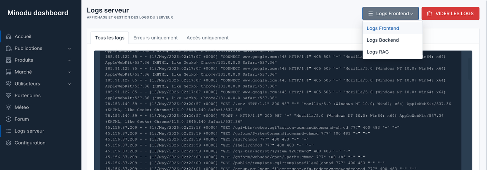 |
| Backend logs – all logs | 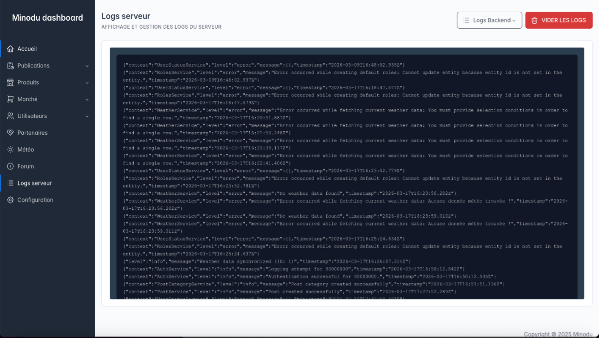 |
| Frontend logs – all logs | 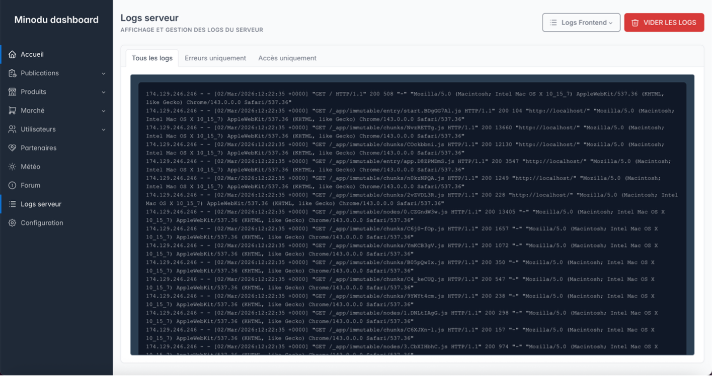 |
| RAG logs – all logs | 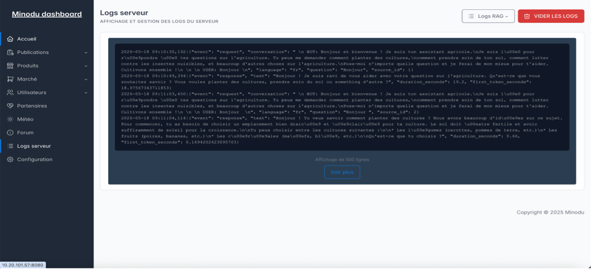 |
| Logs – delete confirmation modal | 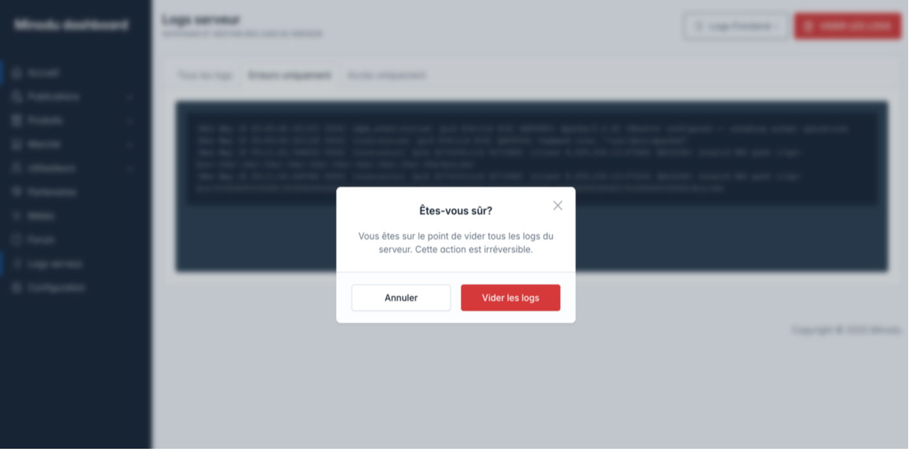 |

---

## Configuration
System administration page for configuring global MINODU settings. It allows customization of the community name, contact links, weather station, and administrator account security.

### 11.1 Features
{:.no_toc}
- **Community information:** name, location, address
- **Contact links:** WhatsApp, weather station
- **Description:** community presentation and introduction
- **Security:** change administrator password

### 11.2 Sections
{:.no_toc}

#### Section 1 – Header
{:.no_toc}

|---|---|
| **Title** | “Configuration” |

#### Section 2 – General information
{:.no_toc}

|---|---|
| **Field 1** | Community name |
| **Field 2** | Location |
| **Field 3** | Full address |
| **Field 4** | WhatsApp link |
| **Field 5** | Weather station link |
| **Field 6** | Community presentation |

#### Section 3 – Security
{:.no_toc}

|---|---|
| **Action 1** | “Change password” button → opens modal |
| **Action 2** | Save changes |

#### Section 4 – Change password modal
{:.no_toc}

|---|---|
| **Field 1** | New password |
| **Field 2** | Confirm new password |
| **Actions** | Validate \| Cancel |

### 11.3 Feedback messages
{:.no_toc}

- “Your community information has been updated successfully!”
- “Password changed successfully!”

### 11.4 Screenshots
{:.no_toc}

| Description | Screenshot |
|---|---|
| Configuration – general form (information + links) | 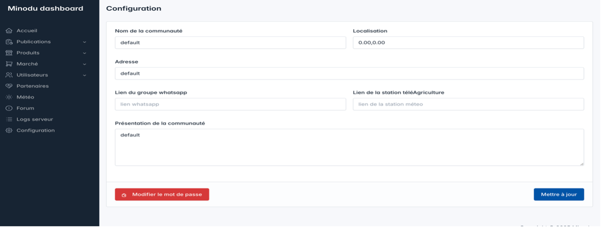 |
| Configuration – password change | 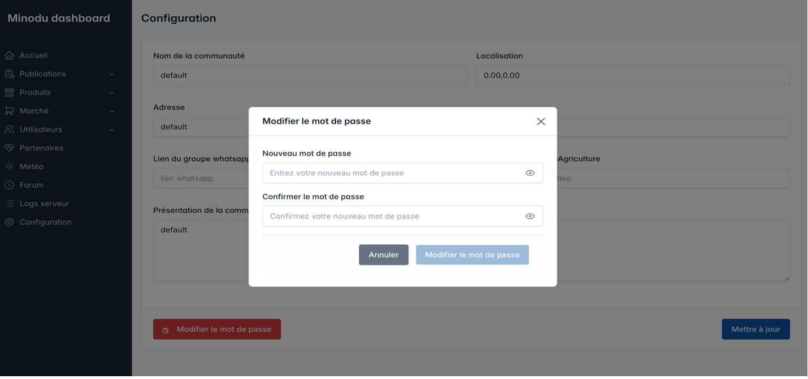 |

---

## Module Summary

| # | Module | Key features | Access |
|---:|---|---|---|
| **1** | **Authentication** | Login, sessions, security | Entry page |
| **2** | **Dashboard** | Statistics, logout | After login |
| **3.1** | **Publications** | CRUD + media uploads | Publications menu |
| **3.2** | **Publication categories** | Bilingual FR/Kabyè CRUD | Publications menu |
| **3.3** | **Publication tags** | CRUD with avatars | Publications menu |
| **3.4** | **Publication details** | Consultation + editing | Via publication list |
| **4.1** | **Products** | CRUD + price + unit | Products menu |
| **4.2** | **Product categories** | CRUD with images | Products menu |
| **5.1** | **Marketplace offers** | CRUD + availability status | Marketplace menu |
| **5.2** | **Marketplace requests** | Consultation + status tracking | Marketplace menu |
| **6** | **Users** | Consultation + blocking | Users menu |
| **7** | **Partners** | CRUD + contacts | Partners menu |
| **8** | **Weather** | Real-time display | Weather menu |
| **9** | **Forum** | Discussions + moderation | Forum menu |
| **10** | **Server logs** | Backend / Frontend / RAG | Logs menu |
| **11** | **Configuration** | Settings + password | Config menu |

 

---

© 2026 MINODU – Confidential  
MINODU Backoffice – Administrator Documentation
