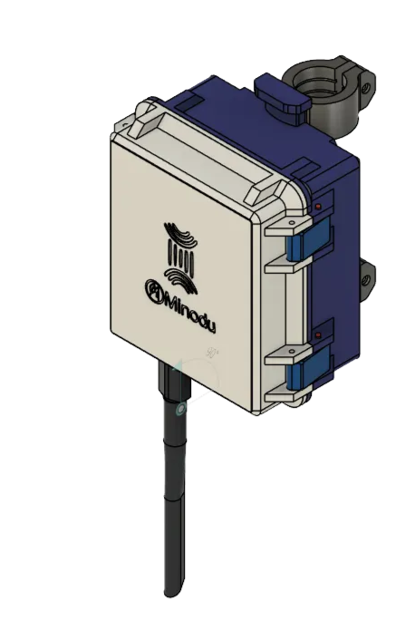
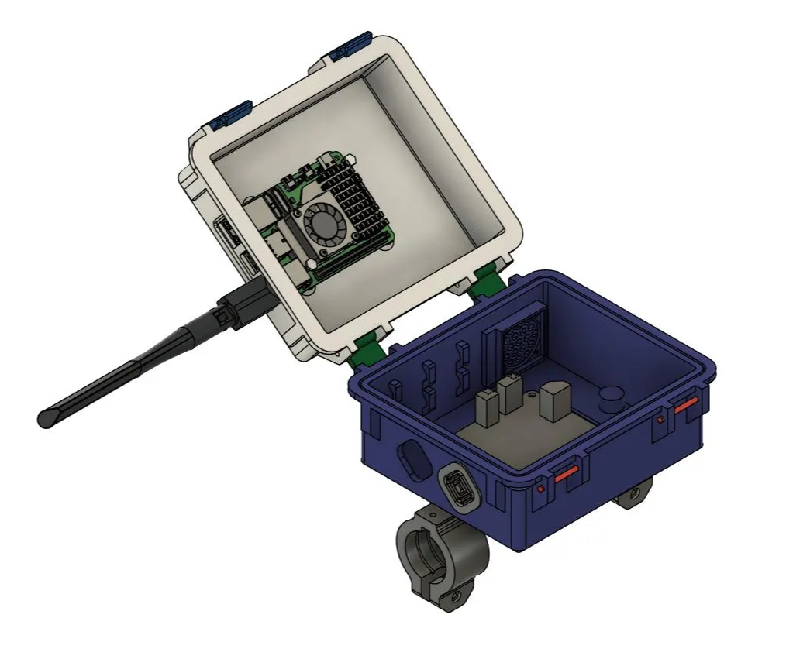
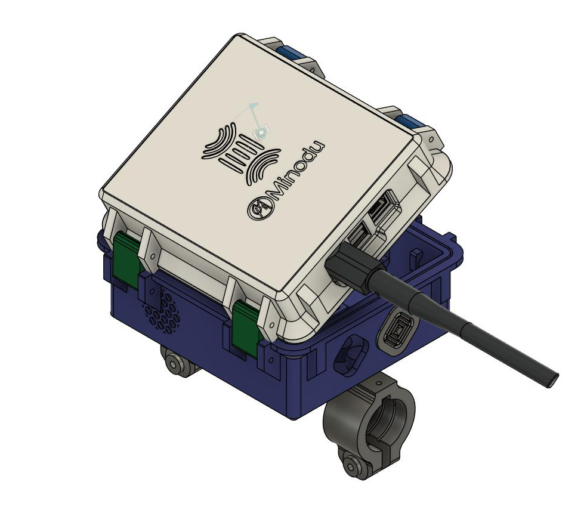
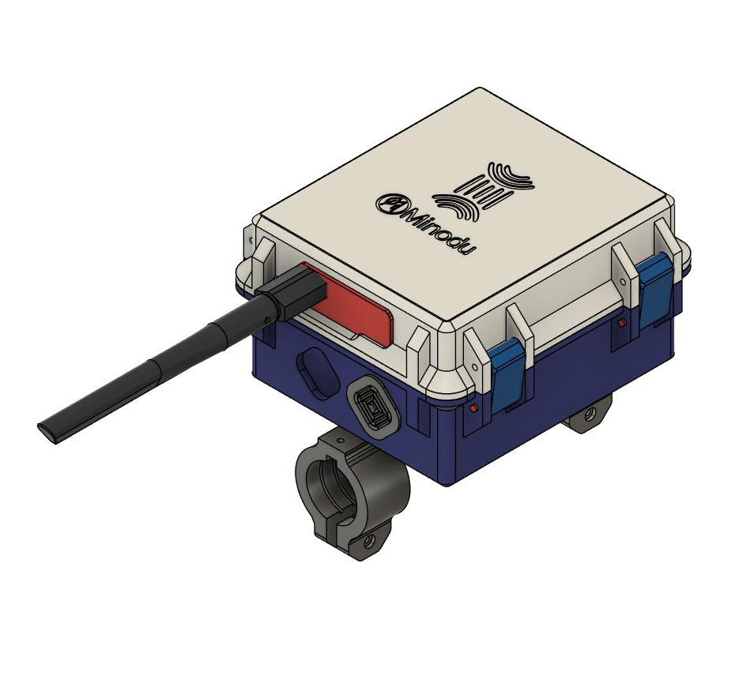

# The Hardware To build

https://a360.co/4q3GGlT

Design 0B - Fixation With screw and Bracket

Pictures:

Assembling

<iframe
  src="https://YoutubePlaceHolder"
  style="width:100%; height:480px;"
></iframe>

# Requirements

- weatherproof: rain-, dust- and windproof
- openable for maintenance
- Contain RPi 5+ SolarPower Manager board(Type to be confirmed) with The TelaAgriculture board stacked on Top

## Sensors

- Output for the sensors
- Possibility of measuring UV light
- Stevenson Screen for environmental sensors that need to be protected but still measure temperature, humidity, etc.
- Weather Meter connection

Minodu Sensors

## Solar Power

- Input for the solar panel cables

Battery-Solar-Power pour le LCN

- Technical Summary – Solar Power System for Raspberry Pi 5 (For 24/7 Operation)

Other Boxes

# Images - Development Process

## [Link to Design (Autodesk Fusion 360)](https://a360.co/4q3GGlT): https://a360.co/4q3GGlT

<iframe
  src="https://a360.co/4q3GGlT"
  style="width:100%; height:720px;"
></iframe>

# 3D printing & Assembly Instruction

## 3D printing

### What do we need to print and How

*3D Files*

**What do**

### How to 3D print the STL files above ? (I you already know how to slice the STL files skip to XX)

3D printers only understand G CODE language (**geometric code)**; So what we need to do is to convert the *STL* files into G CODE. for that we need a type of Software call slicer. I personally use [OrcaSlicer](https://www.orcaslicer.com/) but they all work the same.

What this quick video to get you started if you are new to 3D printing with OrcaSlicer :

<iframe
  src="https://www.youtube.com/watch?v=KWfKkeOSpmw"
  style="width:100%; height:480px;"
></iframe>

Here is The Orca slicer projectfile withh all the parts
    - [Minodu_Box.3mf](../assets/3dFiles/Minodu_Box.3mf)
here is the list and number of files to print:
*3D Files*
*ABS or at least PETG for outdoor setup*
 - [01x Base](../assets/3dFiles/Base_x01.stl)
 - [01x Top](../assets/3dFiles/Top_x01.stl) if you can Print Mulitcolor use This         [Top_x01-MultiColor.stl](../assets/3dFiles/Top_x01-MultiColor.stl)
 - [02x Hinge](../assets/3dFiles/Hinge_x02.stl)
 - [02x Latch](../assets/3dFiles/Latch_x02.stl)
 - [02x Latch clip](../assets/3dFiles/Clip_x02.stl)

 *TPU parts*
 - [02x TPU Cable outlet cap](../assets/3dFiles/TPU_CableOutletCap_x02.stl)
 - [01x TPU RPi5 ports dust cap](../assets/3dFiles/TPU_RPi5PortDustCaps_x01.stl)
 - 
##