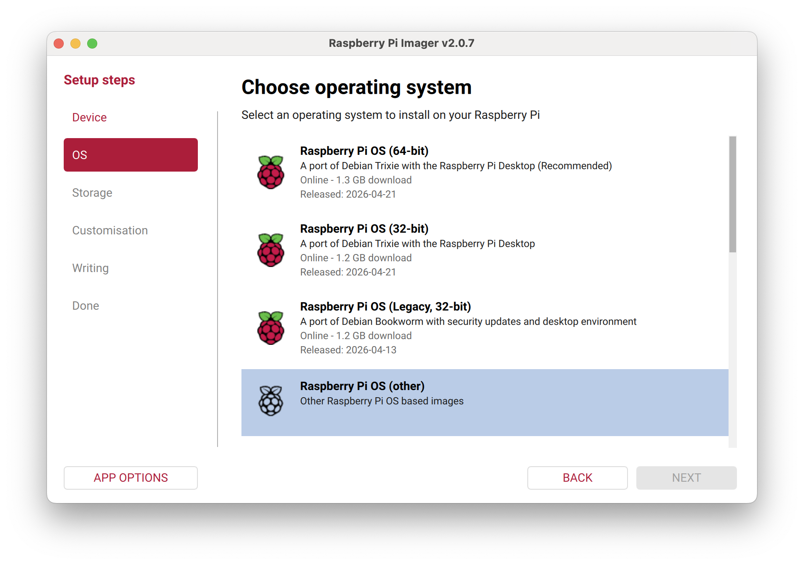
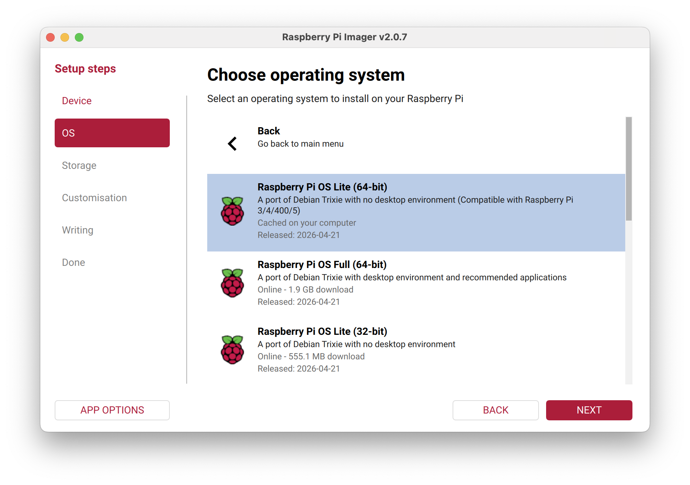
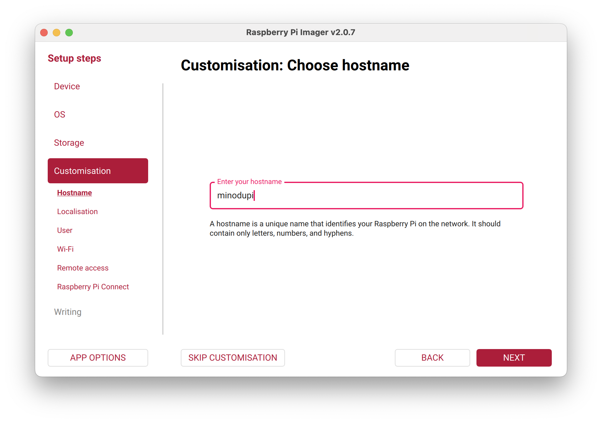
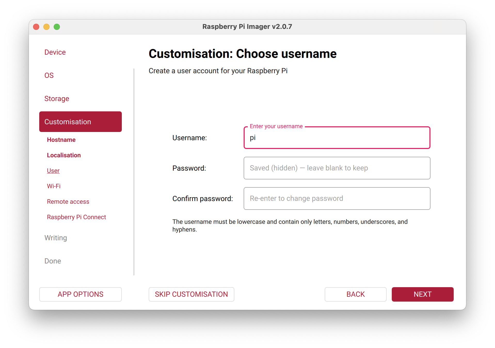
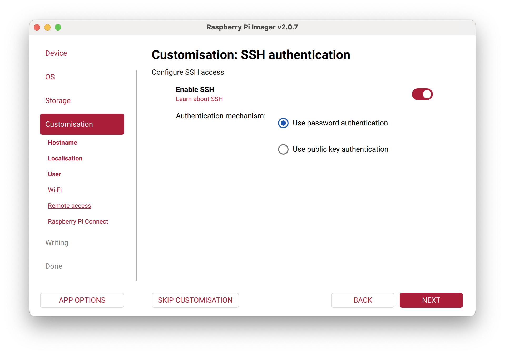

This will guide you through the setup process of the Minodu LCN on the Raspberry Pi.

## Content
{:.no_toc}
* TOC
{:toc}


## Requirements

* Raspberry pi 4 or 5
* Ethernet adapter and a cable
* SD card reader and an sd card with a minimum size if 64gb.
* Python to be installed on your computer

## Setup Raspberry Pi Image

### Create Base Image

* Install Raspberry Pi OS Lite (64 bit) on Raspberry Pi. *Tested with this [version](https://downloads.raspberrypi.com/raspios_lite_arm64/images/raspios_lite_arm64-2026-04-21/)*. You can use [Raspberry PI Imager](https://www.raspberrypi.com/software/) to crate the Image



* Set the hostname to minodupi.local, the username to pi and enable ssh in the custom settings of the image. remember the password you choose and write it down.



* Once the image is written, insert the sd card into the pi

### Connect to RPI

* Connect via ethernet cable to raspberry pi and enable internet Sharing on mac, alternativly, you can plug the raspberry pi into your dhcp router via ethernet
* Make sure `ping minodupi.local` returns an answer, meaning your machine can discover the raspberry pi in the network
* Alternative: Connect Monitor do RPI and type in `ifconfig` to find out the RPIs ip address and use that one instead of *minodupi.local*

## Install MinoduLCN

* Download and unzip the minodu installer from [https://github.com/MinoduLCN/minodu-installer/archive/refs/heads/main.zip](https://github.com/MinoduLCN/minodu-installer/archive/refs/heads/main.zip) or download it with `curl -L https://github.com/MinoduLCN/minodu-installer/archive/refs/heads/main.zip -o repo.zip && unzip repo.zip`
* Open a terminal and run:
  ```
  cd minodu-installer-main
  pip install pyinfra
  # run full install script
  pyinfra @ssh/minodupi.local deploy.py -v --ssh-user="pi" --ssh-password="<pi-user-password>"
  # or using an ip address
  pyinfra @ssh/<ip-address> deploy.py -v --ssh-user="pi" --ssh-password="<pi-user-password>"
  # or run a single step 
  pyinfra @ssh/minodupi.local 01_system_packages.py -v --ssh-user="pi" --ssh-password="<pi-user-password>"
  ```
* It will ask you the following options. In [brackets] is the default value if you leave it empty. Installing the llm is only recommended on a raspberry pi 5 with at least 8gb of ram and a good cooling fan.
  ```
  WiFi SSID [Minodu]:
  WLAN country code [DE]:
  RaspAP admin password [secret]:
  Install Minodu LLM for Chatbot (y/n) [n]:
  Admin phone number [90000000]:
  Admin password [secret]:
  ```
* Follow the instructions and wait until the installer is done, if you select to install the llm the install procedure will take much longer, since it needs to build the vector database on the raspberry pi.
* If the installer fails at any time because of a connection error, restart the installation script. it should skip already completed steps.

## Manual installation
If the installation script fails, you can check this repo to guide you through the manual installation process: [https://github.com/MinoduLCN/minodu-installer](https://github.com/MinoduLCN/minodu-installer).
  
## Troubleshooting

* Make sure raspberrpi is reachable with `ping minodupi.local`. If not. reinstall image and make sure to set the hostname to minodupi.local
* make sure there is a user on the raspberry pi with the name *pi* (standard username).
* Make sure ssh is enabled, test with `ssh pi@minodupi.local`. Default password is *raspberry*. If it is not working reinstall image and enable ssh access.
* Make sure your computer is connected to the internet during the install procedure.

