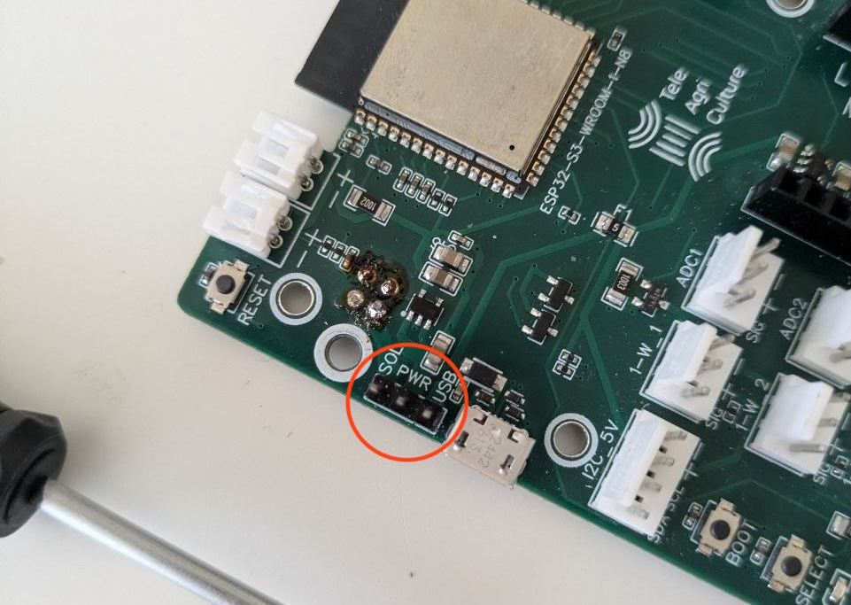
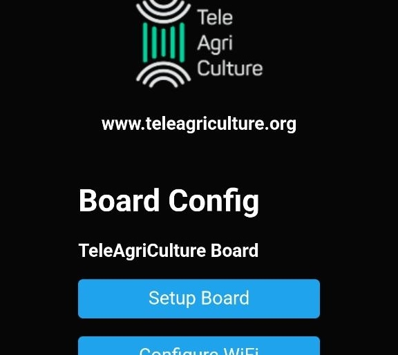
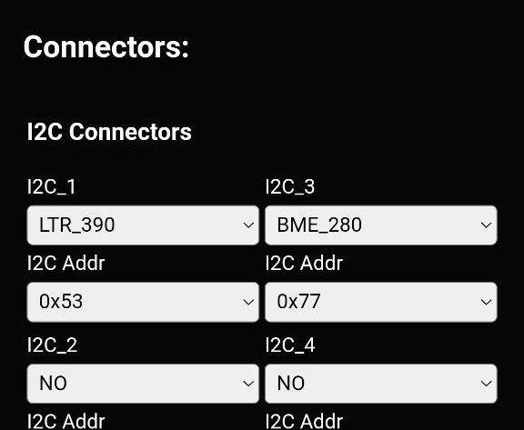
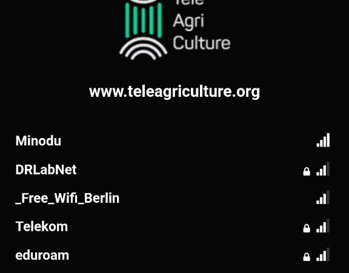

The Teleagriculture board is a weather station that reads out the current sensor data and sends it to the Minodu server. The Minodu server saves and analyzes the weather data. This page guides you on how to set up your Teleagriculture board and connect it to the Minodu system.

Teleagriculture is an Open Source Project. You can find more information about it here: (https://github.com/TeleAgriCulture/main)[https://github.com/TeleAgriCulture/main]

This guide explains how to setup the board for integrating it into the Minodu System

## Board Assembly

| **Step 1:** Install the lcd module by pluging it into the pin header on the board and securing it with 2 screws |  |
| **Step 2:** Plug the lcd module enable jumper in the "On" position  |  |
| **Step 3:** Set the jumper on the Teleagriculture board to use USB power by setting the jumper on the USB position  |  |

## Upload Minodu Firmware

You need to upload the specific Minodu firmware to the Teleagriculture Board. There are two ways to do that:

### Upload firmware via config menu

* Download the firmware file to your computer from here: [https://github.com/MinoduLCN/minodu-teleagriculture-firmware/raw/refs/heads/main/Firmware/firmware_EU_868_v_m179.bin](https://github.com/MinoduLCN/minodu-teleagriculture-firmware/raw/refs/heads/main/Firmware/firmware_EU_868_v_m179.bin)
* Power up the Teleagriculture Board, make sure it's in config mode, and connect to its wifi. SSID: *Teleagriculture Board*, Password: *enter123*
* Open the captive page, select *Update*, and select the firmware file you previously downloaded.

### Upload firmware via PlatformIO

* Clone the Minodu TAC repository: `git clone https://github.com/MinoduLCN/minodu-teleagriculture-firmware`
* Open the project in VS Code with the PlatformIO extension installed.
* Connect the Teleagriculture board to your computer.
* Press Upload in VS Code in the upper-right corner of the UI.

## Connect Sensors

Connect the sensors to the following ports on the Teleagriculture Board:

| Sensor                     | Connection | Description |
| -------------------------- | ---------- | ----------- |
| Multichannel Gas Sensor V2 | I2C (5V)   | NO2, CO, C2H5OH |
| BME 280                    | I2C (3V)   | Temperature, Humidity, Pressure |
| LTR 390                    | I2C (3V)   | ambient light, UVA (UV light) |
| DHT22                      | 1-W_1      | Temperature & Humidity (placed inside the protection box) |

## Setup Firmware configuration

This step guides you on how to configure the Teleagriculture board to connect to your Minodu network.

| **Step 1:** Make sure the power jumper is set to the *usb* power position. |  |
| **Step 2:** Connect the TAC Board to the power via a micro USB Cable  |  |
| **Step 3:** The display should show *Config Mode*. If it is not in config mode, press reset, then press the boot button for about 5 secs.  |  |
| **Step 4:** Connect to the board via wifi, SSID is *Teleagriculture Board*, the password is *enter123*, and open the captive page by pressing *Sign In*. |   |
| **Step 5:** Enter *Setup Board* and select the sensors that are connected to the board by selecting the specific sensor for the connectors. Make Sure to specify the right connector to which the sensor is attached to. |   |
| **Step 6:** Enter *Setup Wifi* and connect to the network of your Minodupi. |   |

Your Teleagriculture Board is now connected to your Minodu system. The current weather data should be shown within the Minodu app and can be downloaded through the backoffice.